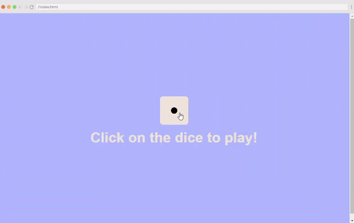

  # Js-Scrimba-Challenge

24 days of java script challenge from scrimba.com
  

<h3 align="center">
 Day8
  </h3> 

  

Rolling Dice
  
 
  

In this challenge a casino has asked you to make an online dice that works just like 
it would in real life. Using the pre-made dice face that represents ‘one’, make the 
faces for ‘two’, ‘three’, ‘four’, ‘five’ and ‘six’. Now when the users clicks the 
dice on the screen the dice is expected to show one of the faces randomly.
   
 
<h4 align="center">
   Here my coding result
  </h4>
  

  

  
